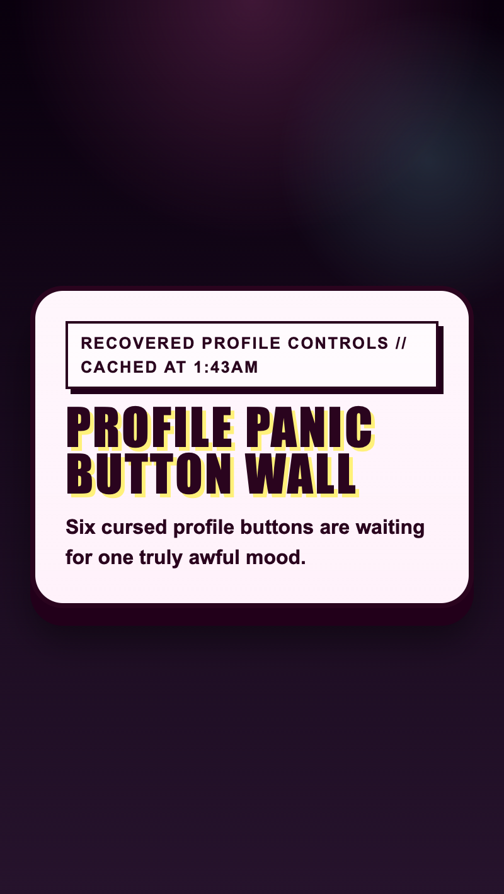

<h2 class="c-project-heading--task">Add the cursed control header</h2>

Add the visible header inside `<main class="button-stage">` so the page stops looking empty.

<h2 class="c-project-heading--explainer">Make this change</h2>

Open `index.html`. The starter file has an empty `<main>` element, so add the eyebrow, the main heading, and the short paragraph inside it.

--- code ---
---
language: html
filename: index.html
line_numbers: true
line_number_start: 1
line_highlights: 10-14
---
<!doctype html>
<html lang="en">
  <head>
    <meta charset="utf-8">
    <meta name="viewport" content="width=device-width, initial-scale=1">
    <title>PROFILE PANIC BUTTON WALL</title>
    <link rel="stylesheet" href="style.css">
  </head>
  <body>
    <main class="button-stage">
      
Recovered profile controls // cached at 1:43am

      <h1>PROFILE PANIC BUTTON WALL</h1>
      
Six cursed profile buttons are waiting for one truly awful mood.

    </main>
  </body>
</html>
--- /code ---

## Now run your code

You should see the recovered profile header inside the panel instead of a blank box.

  

