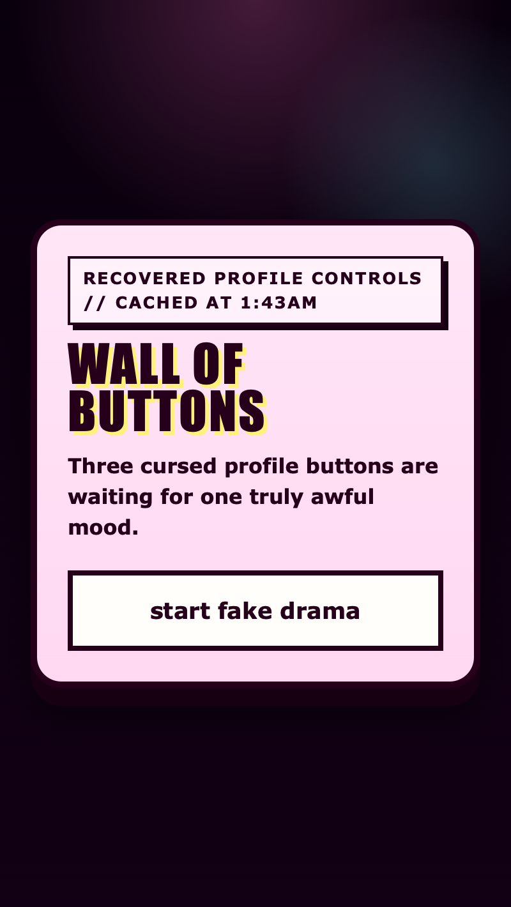

<h2 class="c-project-heading--task">Add one button to the wall</h2>

Add one loud button so the wall stops looking empty.

<h2 class="c-project-heading--explainer">Make this change</h2>

## Step 1
Run the code to see the unstyled page.

## Step 2
Put a button inside `<section class="button-wall">`, then add the matching audio element underneath the section:

--- code ---
---
language: html
filename: index.html
line_numbers: true
line_number_start: 10
line_highlights: 15,18
---
    <main class="button-stage">
      
Recovered profile controls // cached at 1:43am

      <h1>WALL OF BUTTONS</h1>
      
Three cursed profile buttons are waiting for one truly awful mood.

      <section class="button-wall">
        <button class="silly-button drama" type="button">start fake drama</button>
      </section>

      <audio id="drama-sound" src="drama.mp3" preload="auto"></audio>
    </main>
--- /code ---

## Now run your code

You should now see one plain button in the wall, and the audio file will be ready for later.

  

