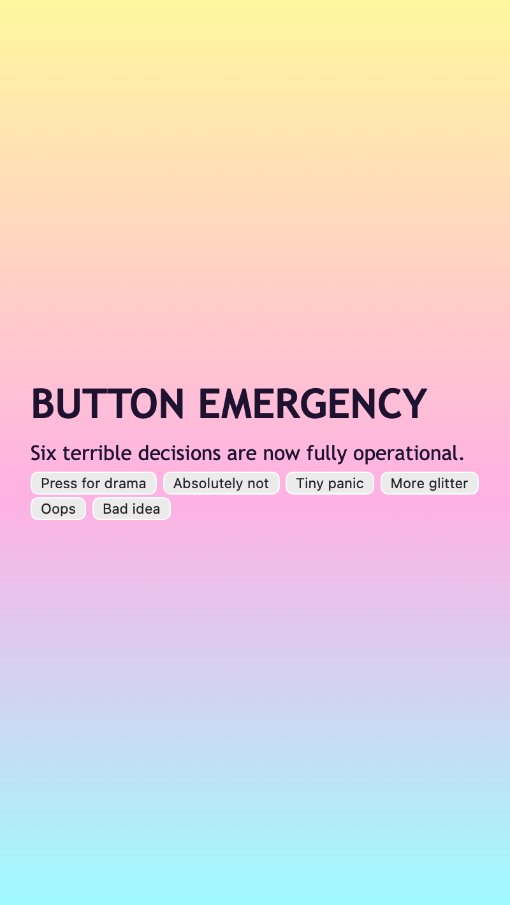

<h2 class="c-project-heading--task">Style the page text</h2>

You will give the page a loud background and make the heading and paragraph feel more deliberate.

### Step 1

Open `style.css` and start with these `*` and `body` rules.

<h3>Tip</h3>

`background` changes the whole mood of the page.

`font-family` changes whether the page feels plain, playful, or dramatic.

`color` changes the main text colour used across the page.

--- code ---
---
language: css
filename: style.css
line_numbers: true
line_number_start: 1
line_highlights: 1-15
---
/* Start with the page background and the main text styles. */
* {
  box-sizing: border-box;
}

body {
  margin: 0;
  min-height: 100vh;
  display: grid;
  place-items: center;
  padding: 24px;
  font-family: "Trebuchet MS", Verdana, sans-serif;
  color: #1d1230;
  background: linear-gradient(180deg, #fff79e, #ffb1e4 55%, #9ffaff 100%);
}
--- /code ---

### Step 2

Underneath the `body` rule, add the `h1` rule to make the heading larger and louder.

--- code ---
---
language: css
filename: style.css
line_numbers: true
line_number_start: 15
line_highlights: 17-22
---
}

h1 {
  margin: 0;
  font-size: clamp(2rem, 6vw, 3.5rem);
  line-height: 0.95;
  text-transform: uppercase;
}
--- /code ---

### Step 3

Underneath the `h1` rule, add the `p` rule so the smaller text stays readable.

<h3>Tip</h3>

`font-size` changes how shouty the heading feels.

`text-transform` turns the heading into uppercase without rewriting the text.

`line-height` changes whether the paragraph feels cramped or airy.

--- code ---
---
language: css
filename: style.css
line_numbers: true
line_number_start: 22
line_highlights: 24-28
---
}

p {
  margin: 12px 0 0;
  font-size: 1rem;
  line-height: 1.5;
}
--- /code ---

<h2 class="c-project-heading--task">Test</h2>

The page should now have a loud background, a big heading, and a readable little paragraph.

  

