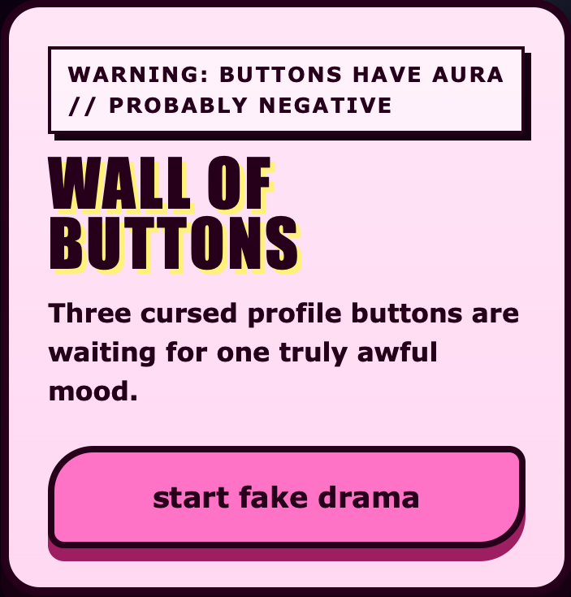

<h2 class="c-project-heading--task">Give it its own CSS class</h2>

Add a `.drama` CSS class so the first button gets its loud pink shape.

<h2 class="c-project-heading--explainer">Make this change</h2>

Open `style.css` and add these rules underneath `.silly-button`.

--- code ---
---
language: css
filename: style.css
line_numbers: true
line_number_start: 95
line_highlights: 99-108
---
  cursor: pointer;
  transition: transform 0.18s ease, box-shadow 0.18s ease, background 0.18s ease, letter-spacing 0.18s ease, filter 0.18s ease;
}

.drama {
  background: var(--accent-hot);
  border-radius: 28px 10px 28px 10px;
  box-shadow: 0 8px 0 #9d1e61;
}

.drama:hover {
  transform: translateY(-4px) rotate(-2deg);
  box-shadow: 0 12px 0 #9d1e61;
}
--- /code ---

<h3>Tip</h3>

Try changing the background colour, border radius, or shadow if you want the button to feel even more dramatic.

## Now run your code

The drama button should now look bright pink and hop slightly when you hover over it.

  

