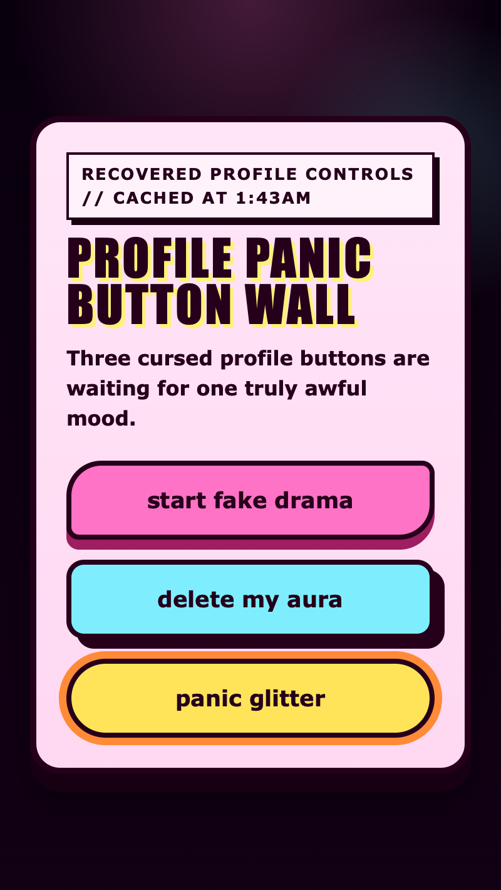

<h2 class="c-project-heading--task">Build the panic button</h2>

Add a third button so the wall finally feels like a proper soundboard.

### Step 1
Add this extra button inside `<section class="button-wall">`, then add the matching audio element underneath the others.

--- code ---
---
language: html
filename: index.html
line_numbers: true
line_number_start: 15
line_highlights: 18-22
---
      <section class="button-wall">
        <button class="silly-button drama" type="button">start fake drama</button>
        <button class="silly-button nope" type="button">delete my aura</button>
        <button class="silly-button panic" type="button">panic glitter</button>
      </section>

      <audio id="drama-sound" src="drama.mp3" preload="auto"></audio>
      <audio id="nope-sound" src="nope.mp3" preload="auto"></audio>
      <audio id="panic-sound" src="panic.mp3" preload="auto"></audio>
--- /code ---

### Step 2
Open `style.css` and add these rules underneath `.nope:hover`.

--- code ---
---
language: css
filename: style.css
line_numbers: true
line_number_start: 119
line_highlights: 119-127
---
.panic {
  background: var(--accent-warning);
  border-radius: 999px;
  box-shadow: 0 0 0 6px #ff8b38;
}

.panic:hover {
  transform: scale(1.06);
  box-shadow: 0 0 0 10px #ff8b38;
}
--- /code ---

### Step 3
Go back to `index.html` and add this click handler underneath the other two.

--- code ---
---
language: html
filename: index.html
line_numbers: true
line_number_start: 29
line_highlights: 33-35
---
      document.querySelector(".nope").addEventListener("click", function () {
        playButtonSound("#nope-sound");
      });

      document.querySelector(".panic").addEventListener("click", function () {
        playButtonSound("#panic-sound");
      });
    </script>
--- /code ---

## Now run your code

You should now have three buttons in the wall, and all three should play their own different sound when clicked.

  

