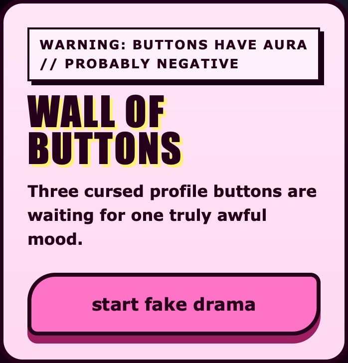

<h2 class="c-project-heading--task">Make it play drama.mp3</h2>

Add one click handler so the drama button plays its sound.

<h2 class="c-project-heading--explainer">Make this change</h2>

In `index.html`, add this code inside `
--- /code ---

## Now run your code

The bright pink button should still hop on hover and now play a short dramatic sound when you click it.

  

