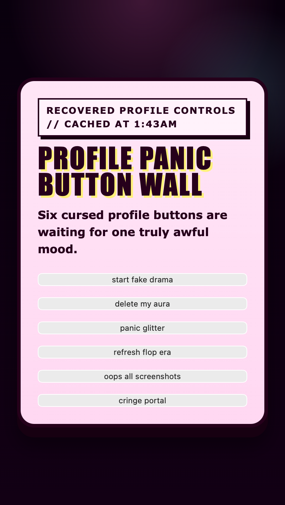

<h2 class="c-project-heading--task">Arrange the button wall</h2>

Turn the button section into a proper wall instead of one awkward row of browser buttons.

<h2 class="c-project-heading--explainer">Make this change</h2>

Stay in `style.css` and add the `.button-wall` rule underneath `.button-stage`.

<h3>Tip</h3>

`grid-template-columns` changes how many buttons can fit across each row.

`gap` changes the space between the buttons.

`margin-top` changes how far the wall sits below the header text.

--- code ---
---
language: css
filename: style.css
line_numbers: true
line_number_start: 79
line_highlights: 79-84
---
.button-wall {
  display: grid;
  grid-template-columns: repeat(auto-fit, minmax(145px, 1fr));
  gap: 16px;
  margin-top: 22px;
}
--- /code ---

## Now run your code

The buttons should now sit in a proper wall instead of drifting around the panel.

  

