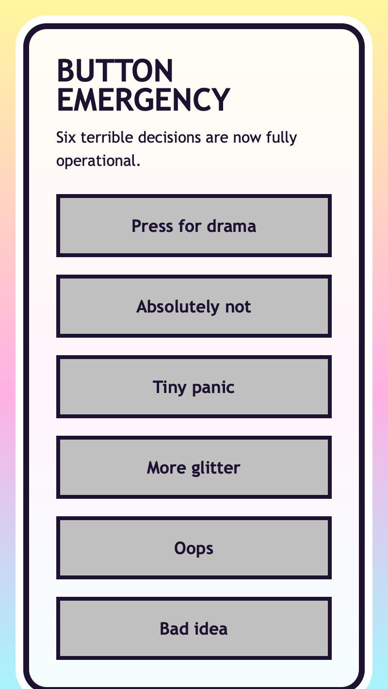

<h2 class="c-project-heading--task">Add the base button style</h2>

You will make all the buttons larger, bolder, and more obviously clickable before you style them individually.

Still in `style.css`, add the shared `.silly-button` rule underneath `.button-wall`.

<h3>Tip</h3>

`padding` changes how chunky each button feels.

`font-size` and `font-weight` change how loud the labels feel.

`border` changes how strong the button outline looks.

`transition` changes how smooth the hover effects feel later.

--- code ---
---
language: css
filename: style.css
line_numbers: true
line_number_start: 46
line_highlights: 48-56
---
}

.silly-button {
  padding: 18px 16px;
  border: 4px solid #1d1230;
  color: #1d1230;
  font: inherit;
  font-size: 1.1rem;
  font-weight: 900;
  cursor: pointer;
  transition: transform 0.2s ease, box-shadow 0.2s ease, background 0.2s ease, letter-spacing 0.2s ease;
}
--- /code ---

<h2 class="c-project-heading--task">Test</h2>

The buttons should now look much bigger and bolder, even though they still share one plain style.

  

