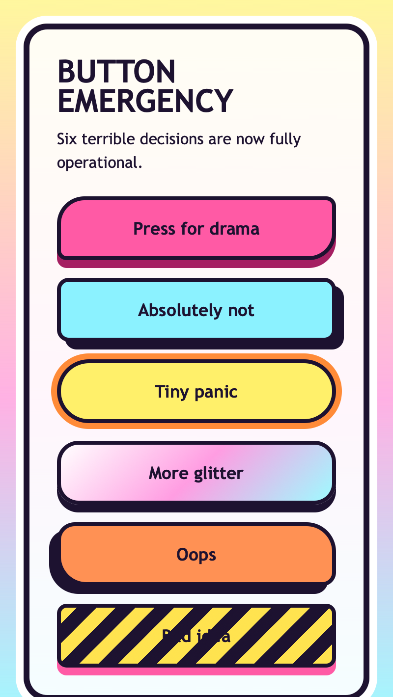

<h2 class="c-project-heading--task">Make every button absurd</h2>

You will give each button its own silly look and a visibly different hover state.

Stay in `style.css` and add the individual button colours, shapes, and hover effects.

<h3>Tip</h3>

`background` sets the button colours or gradients.

`border-radius` changes the button shape from sharp to weirdly rounded.

`box-shadow` changes how raised or dented the button looks.

`transform` changes how each button reacts on hover.

### Step 1

Add the `drama` button styles first so one button already feels theatrical.

--- code ---
---
language: css
filename: style.css
line_numbers: true
line_number_start: 59
line_highlights: 59-68
---
.drama {
  background: #ff5aa5;
  border-radius: 28px 10px 28px 10px;
  box-shadow: 0 8px 0 #a51f62;
}

.drama:hover {
  transform: translateY(-4px) rotate(-2deg);
  box-shadow: 0 12px 0 #a51f62;
}
--- /code ---

### Step 2

Underneath the `drama` rules, add the `nope` button so it feels flatter and more awkward.

--- code ---
---
language: css
filename: style.css
line_numbers: true
line_number_start: 70
line_highlights: 70-80
---
.nope {
  background: #8bf2ff;
  border-radius: 12px;
  box-shadow: 8px 8px 0 #1d1230;
}

.nope:hover {
  background: #46d7ff;
  transform: rotate(3deg);
  letter-spacing: 0.08em;
}
--- /code ---

### Step 3

Now add the `panic` button so one of the buttons looks round and overexcited.

--- code ---
---
language: css
filename: style.css
line_numbers: true
line_number_start: 82
line_highlights: 82-91
---
.panic {
  background: #fff06a;
  border-radius: 999px;
  box-shadow: 0 0 0 6px #ff8b38;
}

.panic:hover {
  transform: scale(1.06);
  box-shadow: 0 0 0 10px #ff8b38;
}
--- /code ---

### Step 4

Underneath `panic`, add the `glitter` button styles to make one button shiny and excessive.

--- code ---
---
language: css
filename: style.css
line_numbers: true
line_number_start: 93
line_highlights: 93-102
---
.glitter {
  background: linear-gradient(135deg, #ffffff, #ff9de2, #9ffaff);
  border-radius: 22px;
  box-shadow: 0 8px 0 #1d1230;
}

.glitter:hover {
  transform: translateY(-4px);
  background: linear-gradient(135deg, #fff4a5, #ff7fcc, #6ff1ff);
}
--- /code ---

### Step 5

Add the `oops` button rules so one button looks a bit bent and badly assembled.

--- code ---
---
language: css
filename: style.css
line_numbers: true
line_number_start: 104
line_highlights: 104-113
---
.oops {
  background: #ff9154;
  border-radius: 18px 30px 14px 30px;
  box-shadow: -8px 8px 0 #1d1230;
}

.oops:hover {
  transform: skew(-4deg, -1deg);
  background: #ff6c4a;
}
--- /code ---

### Step 6

Finish with the `forbidden` button so one button looks like a warning sign nobody should trust.

--- code ---
---
language: css
filename: style.css
line_numbers: true
line_number_start: 115
line_highlights: 115-129
---
.forbidden {
  background:
    repeating-linear-gradient(
      -45deg,
      #ffe34f 0 14px,
      #1d1230 14px 28px
    );
  border-radius: 10px;
  box-shadow: 0 8px 0 #ff5aa5;
}

.forbidden:hover {
  transform: translateY(-2px) scale(1.03);
  box-shadow: 0 12px 0 #ff5aa5;
}
--- /code ---

<h2 class="c-project-heading--task">Test</h2>

Hover over the wall and each button should react in its own ridiculous way.

  

